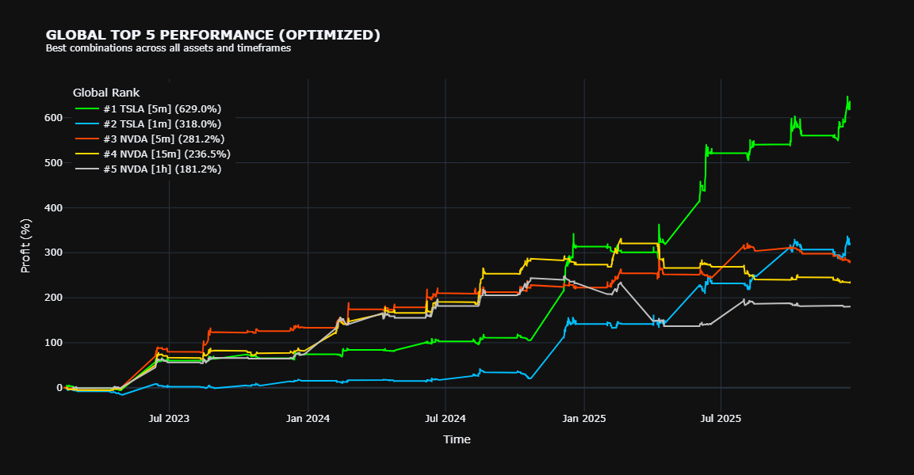

# Project AI Trade: Hybrid Random Forest & Aggressive Pyramiding Strategy



## 📌 Tentang Proyek
Proyek ini adalah sistem **Optimasi Trading Otomatis** yang dikembangkan sebagai Tugas Akhir mata kuliah **AI for Trading**. Sistem ini menggabungkan kecerdasan buatan (*Machine Learning*) dengan strategi manajemen risiko agresif untuk memaksimalkan profit pada pasar saham teknologi.

Pendekatan utama yang digunakan adalah **Hybrid Model**:
1. **Random Forest Classifier**  
   Menentukan bias arah tren jangka panjang (Bullish/Bearish) untuk memfilter sinyal palsu.
2. **Aggressive Pyramiding**  
   Menambah posisi secara bertahap (*scaling in*) saat tren terkonfirmasi, dengan perlindungan *Trailing Stop* berbasis ATR.

**Judul Laporan:**  
*Pengembangan Sistem Optimasi Trading Otomatis Berbasis Hybrid Random Forest dan Aggressive Pyramiding pada Multi-Aset Teknologi.*

### 👥 Penulis
- **Putu Gde Kenzie Carlen Mataram** (71230994)  
- **Tara Tirtanata** (71231056)

---

## 🚀 Fitur Utama
- **Machine Learning Signal Filter**  
  Menggunakan Random Forest yang dilatih pada timeframe 1 jam untuk mendeteksi tren makro, sehingga strategi hanya masuk pasar saat probabilitas profit tinggi.
- **Aggressive Pyramiding**  
  Strategi akumulasi posisi yang memanfaatkan momentum tren kuat.
- **Dynamic Trailing Stop**  
  Menggunakan indikator ATR (*Average True Range*) untuk mengamankan profit secara otomatis.
- **Automated Hyperparameter Tuning**  
  Modul pencarian parameter terbaik (*Stop Loss Multiplier*, *ADX Threshold*, *Max Layers*) untuk tiap aset (AAPL, NVDA, TSLA, dll).
- **Multi-Asset & Multi-Timeframe**  
  Mendukung pengujian pada berbagai aset teknologi dan timeframe intraday (1m, 5m, 15m, 1h).

---

## 📂 Struktur File
```bash
project-aitrade/
│
├── market_data/                   # Data historis saham (CSV)
│   ├── AAPL_1m.csv
│   ├── NVDA_1m.csv
│   └── ... (aset lainnya)
│
├── optimalism_hybrd_pyramid.ipynb # [CORE] Notebook utama
├── dataTradeDownload.py           # Script download data via API
├── Laporan Tugas Akhir.pdf        # Laporan teknis proyek
├── Laporan_Tuning.xlsx            # Log optimasi parameter
└── newplot.png                    # Visualisasi performa strategi
````

---

## 🛠️ Instalasi & Persyaratan

Pastikan Anda telah menginstal **Python 3.10+** dan **Jupyter Notebook**.

Install seluruh dependensi dengan perintah:

```bash
pip install backtesting yfinance pandas_ta plotly scikit-learn numpy pandas openpyxl twelvedata
```

**Library Utama:**

* `backtesting` – Engine simulasi trading
* `scikit-learn` – Implementasi Random Forest
* `pandas_ta` – Indikator teknikal (RSI, ADX, EMA, ATR)
* `plotly` – Visualisasi grafik interaktif

---

## 💻 Cara Penggunaan

1. **Persiapan Data**
   Pastikan folder `market_data/` berisi file CSV.
   Data baru dapat diunduh menggunakan `dataTradeDownload.py` (memerlukan API Key Twelvedata).
2. **Jalankan Notebook**
   Buka `optimalism_hybrd_pyramid.ipynb` di Jupyter Notebook atau VS Code.
3. **Eksekusi Strategi**

   * *Load Data & Train Model*
   * *Backtest* dengan fungsi `run_strategy()`
   * *Hyperparameter Tuning* untuk mencari konfigurasi terbaik per aset

---

## 📊 Logika Strategi (Snippet)

Keputusan *entry* dan *exit* didasarkan pada logika berikut:

```python
# 1. Entry Logic
# Tren kuat, harga di atas EMA50, dan sinyal ML bullish
if (ADX > 25) and (Price > EMA50) and (ML_Signal == 1):
    Buy_Position()

# 2. Pyramiding
# Harga naik melebihi entry terakhir + ATR
if (Price > Last_Entry_Price + (1.0 * ATR)) and (Current_Layers < Max_Layers):
    Add_Position_Aggressive()

# 3. Exit Logic
# Harga menyentuh trailing stop
if (Price < Trailing_Stop_Level):
    Close_All_Positions()
```

---

## 📈 Hasil Eksperimen

Berdasarkan pengujian pada `Laporan_Tuning.xlsx`:

* Sangat efektif pada aset volatil dengan tren kuat seperti **NVDA** dan **QQQ**
* **Random Forest** mengurangi *drawdown* dengan memfilter kondisi *sideways*
* **Aggressive Pyramiding** meningkatkan *Net Profit* secara signifikan saat *strong rally*

*(Grafik performa tersedia pada `newplot.png`)*

---

## ⚠️ Disclaimer

**Proyek ini dibuat untuk tujuan edukasi akademis.
Penulis tidak bertanggung jawab atas risiko finansial yang timbul dari penggunaan strategi ini pada live trading.**

```
